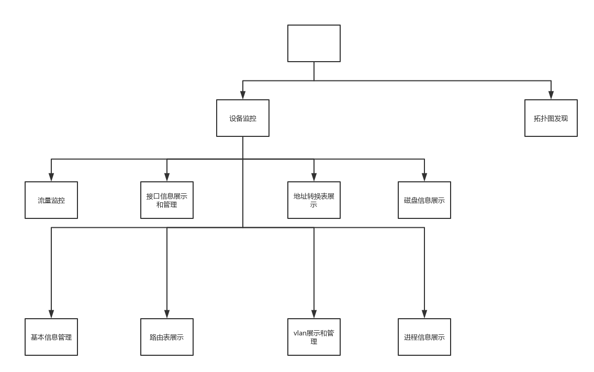

# snmp网络管理软件 说明文档

## 1. 项目简介

### 1.1 简单网络管理协议(SNMP)介绍

对Snmp的理解我觉得可以分为三个部分：

* Snmp协议：包括理解Snmp操作，Snmp消息的格式以及如何在应用程序和设备之间交换消息
* 管理信息结构（SMI）：它是用于指定一个设备维护的管理信息的规则集。管理信息实际上是一个被管理对象的集合，这些规则用于命名和定义这树形结构组织
* 管理信息库（MIB）：设备所维护的全部被管理对象的结构集合，被管理对象按照层次式树形结构组织

而其中**关键**是理解如何**管理**，以及**管理什么**

网络管理模型由三部分构成：管理者， 代理端（Agent）以及Snmp协议，这里管理者就是发出命令的人，snmp协议规定了通信的规则，都很好理解，而代理端却不太好理解。可以这样理解：代理端是一个程序，只有在设备上运行了代理端程序，这个设备才可以被管理者管理，代理端程序就好比是一个身份象征，只有设备上运行了代理程序，那么它才能被管理。所以这里如何**管理**的关键，我觉得就是理解代理端程序的作用。

而具体**管理什么**，就需要对MIB库做一些了解，这里我推荐一个很好用的工具**`MIB Browser`**。

### 1.2 项目需求分析

我们以老师给出的需求作为导向进行开发，老师的需求大致如下：

* 实现对服务器的管理
* 实现网络拓扑的自动发现
* 流量监控
* 任意主机之间连接的查看
* 以及对基本的`系统信息`，`路由表`，`VLAN`，`接口信息`, `地址转换表`等进行管理和展示

### 1.3 项目大致技术和框架

本项目前端使用`vue`作前端页面的框架，并且增加展示效果使用	`bootstrap`框架，后端使用`Java`的`SpringBoot`实现，前端通过`axios`实现前后端的交互，`Snmp`的相关api是基于Java的`Snmp4j`包实现的。

## 2. 项目具体实现分析

### 2.1 前端功能架构展示

前端主要实现了两个功能：

* **拓扑发现功能**，用户在输入一个IP后，我们会尽可能地根据这个IP，得到这个IP所对应的设备所在的网络拓扑结构
* **设备监控功能**，用户指定一个IP和相应的读写权限后，我们可以监控这个设备的相应的信息（已经实现的），包括：
	* 系统信息：包括`系统名称`,`系统IP`，`联系人`,`所在位置`,`系统的OID`,`启动时间`,`系统的描述`, `CPU利用率`等
	* 端口列表:包括`端口名称`, `端口状态`,`入流量`,`出流量`,`物理地址`,`MTU`,`设置管理状态`等
	* vlan列表，与端口列表类似
	* 流量监控，每秒获取一次入流量和出流量的信息
	* 路由信息:包括`目的地址`, `子网掩码`,`下一跳地址`,`协议类型`,`代价Metric`,`Age`等
	* 存储管理:包括`存储器名称`, `存储单元大小`, `使用率`,`总大小`
	* 进程查看：包括`名称`, `进程类型`, `进程运行状态`
	* 地址转换表信息：包括`相应的端口index`,`物理地址`,`IP地址`,`类型`等

### 2.2 后端架构展示

后端使用`Snmp4j`实现Snmp管理功能，使用`springboot`实现前后端交互

主要实现了：

* Snmp4种读写api
	* `snmpget`方法，可以获取单个OID节点上的信息
	* `snmpgetSubTree`方法，可以获取一个OID子树上的信息
	* `snmpwalk`方法，可以获取尽可能多的（一个PDU最多可以承载的数据量）OID节点的信息
	* `snmpset`方法，可以对有写权限的OID节点进行set操作
* springboot实现把前端post命令转化为后端的相应的方法
* 网络拓扑图发现算法

### 2.3 拓扑图发现算法详述

目前的不足之处在于：
* 拓扑发现算法仅仅只能用于有路由器的网络的拓扑结构的发现，对于无路由器，甚至交换机仅仅是二层交换机（没有自己的IP）的网络结构，因为Snmp必须要有IP地址的这个局限性，无法正确地生成相应的拓扑结构
* 对于实现了不同vlan但是却没有相应的IP地址的交换机，目前的算法会因为认为两个vlan是两个不同子网，而把这一个交换机识别为两个不同的交换机。

## 运行环境配置

1. 更新Chrome浏览器， 我们测试的版本是` 67.0.3396.99（正式版本） （32 位）`
2. 安装node.js环境，我们使用的是`node-v8.11.3-x64.msi`
3. 安装java环境，我们使用的是`jdk-8u171-windows-x64.exe`
4. 首先运行后端服务器， 在[github上](https://github.com/xxr5566833/snmpManage/releases/download/v1.0.0/demo-0.0.1-SNAPSHOT.jar)可以下载，下载后，使用命令行进入该jar所在路径，执行命令`java -jar demo-0.0.1-SNAPSHOT.jar`(当然可以重命名)，后端服务器就开始运行了
5. 然后运行前端，进入`web`文件夹，执行如下命令
	1. `npm install http-server -g` 这是全局安装http服务器（第一次执行需要这个命令， 因为是全局安装，故之后运行不需要这个命令）
	2. 在该文件夹下使用cmd执行`http-server `命令
	3. 之后在谷歌浏览器中输入[localhost:8080]()即可进入 
6. 如果想要使用本机`127.0.0.1`测试Snmp功能，还需要在本机上运行Snmp代理端程序，可以使用下面说的`net-snmp`的代理端程序，但Windows自带的代理端程序更好，具体设置的步骤可以参考[这篇博文](https://blog.csdn.net/xumajie88/article/details/18406763)，Windows自带的代理端程序个人感觉速度更快，功能更全，还不需要配置（只需对community做简单配置即可）

## 开发环境配置

这里顺便总结一下开发过程中可能用到的工具

1. Java后端开发IDE`Intelij IDEA`
2. 前端开发编辑器，我一般使用`Sublime` ，当然也可以选择`Webstorm`或者`VSCode`等编辑器
3. Snmp协议的相关工具，可以帮助你更好的理解Snmp，对开发有很大的帮助
	1. `net-snmp`，这里我使用的是`net-snmp-5.5.0-2.x64`，要根据自己的系统版本选择。这个工具可以帮助你在本机运行snmp代理端程序，便于你使用snmp协议对自己电脑做简单管理，而不一定必须处于与交换机，路由器等网络设备真实连接的环境。同时它还实现了`snmpget`,`snmpwalk`,`snmpset`等操作，便于对自己的程序运行状况做出准确判断。
	2. `MIB Browser`，这个工具很实用，它可以实现对相应设备MIB的OID节点信息的浏览和获取，方便你知道哪些OID是实现了的，内容是什么。

4. `git`等版本控制工具

